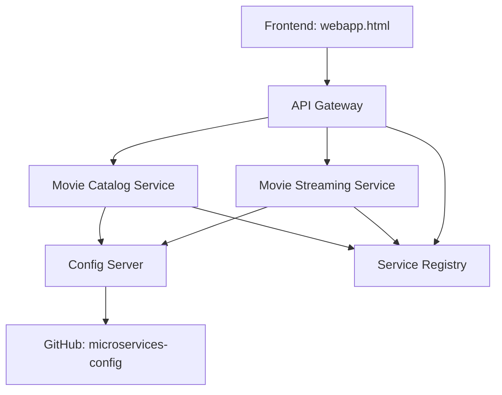

# **S**treamTree — Microservices Video Streaming Project

[](https://openjdk.org/) [](#) [](#)





## **🚀 Project Overview**

_StreamTree is a microservices-based movie streaming demo built with Spring Boot. The project demonstrates centralized configuration, service discovery, routing via an API gateway, and a small static frontend that consumes the APIs._

Key components:

-> Config Server: Centralized configuration for all services using GitHub repo.

-> Service Registry (Eureka): Automatic registration and discovery of microservices.

-> API Gateway: Single entry point routing requests to microservices.

-> Movie Services: Catalog and streaming services.

-> Frontend HTML: Basic web interface to display movies and stream content.


## **📂 Project Structure**

```
StreamTree/
├── api-gateway/                # API Gateway service
├── config-server/              # Spring Cloud Config Server
├── movie-catalog-service/      # Movie catalog microservice
├── movie-streaming-service/    # Streaming microservice
├── service-registry/           # Eureka Service Registry
├── webapp.html                 # Frontend web interface
└── README.md
```


Config Repo (separate): https://github.com/dheeshi/microservices-config

Stores *.properties for all microservices.

Loaded by Config Server at runtime.


## **🛠 Technologies Used**

* Java 17, Spring Boot

* Spring Cloud Config

* Eureka Service Registry

* API Gateway (Spring Cloud Gateway)

* Maven

* Zipkin (distributed tracing)

* HTML / JavaScript (frontend)


## **⚙ How to Run Locally**


***⚙️ Prerequisites***

* Java 17 (JDK)

* Maven

* Git

***🔧 Recommended local tooling & utilities***

* IDE: IntelliJ IDEA (Community or Ultimate) or VS Code — for editing & debugging.

* Postman or curl — for testing APIs.

* MySQL Workbench — for checking database activity.


**Step-by-step :**

*1) clone the repository*

git clone https://github.com/dheeshi/StreamTree.git 

cd StreamTree


*2.1) Start Config Server*

cd config-server  

mvn spring-boot:run


*2.2) Start Service Registry (Eureka)*

cd service-registry

mvn spring-boot:run


*2.3) Start other microservices (catalog, streaming, gateway)*


_a)catalog service_

cd movie-catalog-service

mvn spring-boot:run

_b)streaming service_

cd movie-streaming-service

mvn spring-boot:run

_c)gateway service_

cd api-gateway

mvn spring-boot:run


*3) Open Frontend;*
   
Open webapp.html in a browser.
It will connect to API Gateway endpoints.


_Default local endpoints (examples):_

* Config Server: http://localhost:8888

* Eureka dashboard: http://localhost:8761

* Gateway: http://localhost:8080 (routes to service endpoints)


## **📸 Screenshots**
(complete screenshots of:)

Eureka Dashboard showing registered services; 


API Gateway endpoints response;
localhost movie list : 

postman(get&post):


zipkin tracing : 


Frontend webapp showing movies, single html web page;

landing page


movies list and playing videos


search option


**🔗 Project Links**

GitHub Repo: https://github.com/dheeshi/StreamTree

Config Repo: https://github.com/dheeshi/microservices-config

* Config Server loads service properties from a separate GitHub repo, keeping sensitive info out of the main project.

* Frontend is static HTML for demonstration purposes.


**📝Key Notes (Project Highlights)**

* The basics of microservice architecture
* Created a video streaming app using microservices
* Implementing service registry with Eureka server
* Creating and testing individual microservices
* Using API Gateway with Spring Cloud Routing
* Service-to-service communication
* Centralized configuration management with config server
* Distributed tracing system with Zipkin


