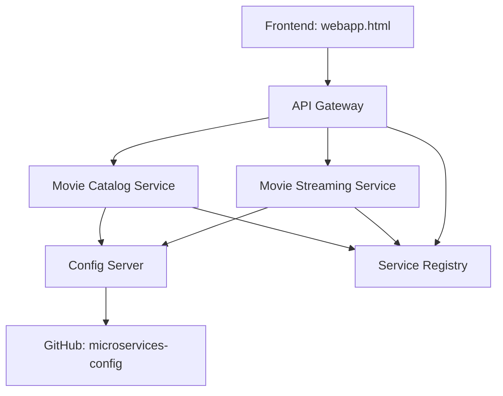

# **S**treamTree — Microservices Movie Streaming Project

  

---

🚀 Project Overview
StreamTree is a microservices-based movie streaming demo built with Spring Boot. The project demonstrates centralized configuration, service discovery, routing via an API gateway, and a small static frontend that consumes the APIs.

Key components:

Centralized configuration with Spring Cloud Config (external config repository)

Service discovery with Eureka

API Gateway using Spring Cloud Gateway

Movie Catalog and Movie Streaming microservices

A static frontend (webapp.html) that calls the gateway

📂 Project Structure
bash
Copy code
StreamTree/
├── api-gateway/                # Spring Cloud Gateway service
├── config-server/              # Spring Cloud Config Server
├── movie-catalog-service/      # Movie catalog microservice
├── movie-streaming-service/    # Movie streaming microservice
├── service-registry/           # Eureka Service Registry
├── webapp.html                 # Frontend web interface (static)
└── README.md
Config repository (external): https://github.com/dheeshi/microservices-config
Contains *.properties or *.yml for each service; read by the Config Server at runtime.

🧰 Technologies
Java 17, Spring Boot

Spring Cloud Config

Eureka Service Registry

Spring Cloud Gateway

Maven

Zipkin (optional for distributed tracing)

HTML / JavaScript (frontend)

⚙️ Prerequisites
Java 17 (JDK)

Maven

Git

(Optional) Docker & Docker Compose

⚙️ How to Run Locally (step-by-step)
Open separate terminal windows for each service. Start services in this order.

Clone repository

bash
Copy code
git clone https://github.com/dheeshi/StreamTree.git
cd StreamTree
Start Config Server

bash
Copy code
cd config-server
mvn clean package -DskipTests
mvn spring-boot:run
Start Service Registry (Eureka)

bash
Copy code
cd ../service-registry
mvn clean package -DskipTests
mvn spring-boot:run
Start Movie Catalog Service

bash
Copy code
cd ../movie-catalog-service
mvn clean package -DskipTests
mvn spring-boot:run
Start Movie Streaming Service

bash
Copy code
cd ../movie-streaming-service
mvn clean package -DskipTests
mvn spring-boot:run
Start API Gateway

bash
Copy code
cd ../api-gateway
mvn clean package -DskipTests
mvn spring-boot:run
Open Frontend

Open webapp.html in a browser (File → Open) or serve via a simple static server. The frontend will call the API Gateway endpoints.

Default local endpoints (examples):

Config Server: http://localhost:8888

Eureka dashboard: http://localhost:8761

Gateway: http://localhost:8080 (routes to service endpoints)

Verify config retrieval:

bash
Copy code
curl http://localhost:8888/movie-catalog-service/default
This should return JSON with properties for movie-catalog-service.

📸 Screenshots
(Add screenshots of:)
Eureka Dashboard showing registered services
API Gateway endpoints response
Frontend webapp showing movies

**🔗 Project Links**

GitHub Repo: https://github.com/dheeshi/StreamTree

Config Repo: https://github.com/dheeshi/microservices-config

-> Config Server loads service properties from a separate GitHub repo, keeping sensitive info out of the main project.

-> Frontend is static HTML for demonstration purposes.

##**📝Key Notes**

The basics of microservice architecture
Create a video streaming app using microservices
Implementing service registry with Eureka server
Creating and testing individual microservices
Using API Gateway with Spring Cloud Routing
Service-to-service communication
Centralized configuration management with config server
Distributed tracing system with Zipkin

