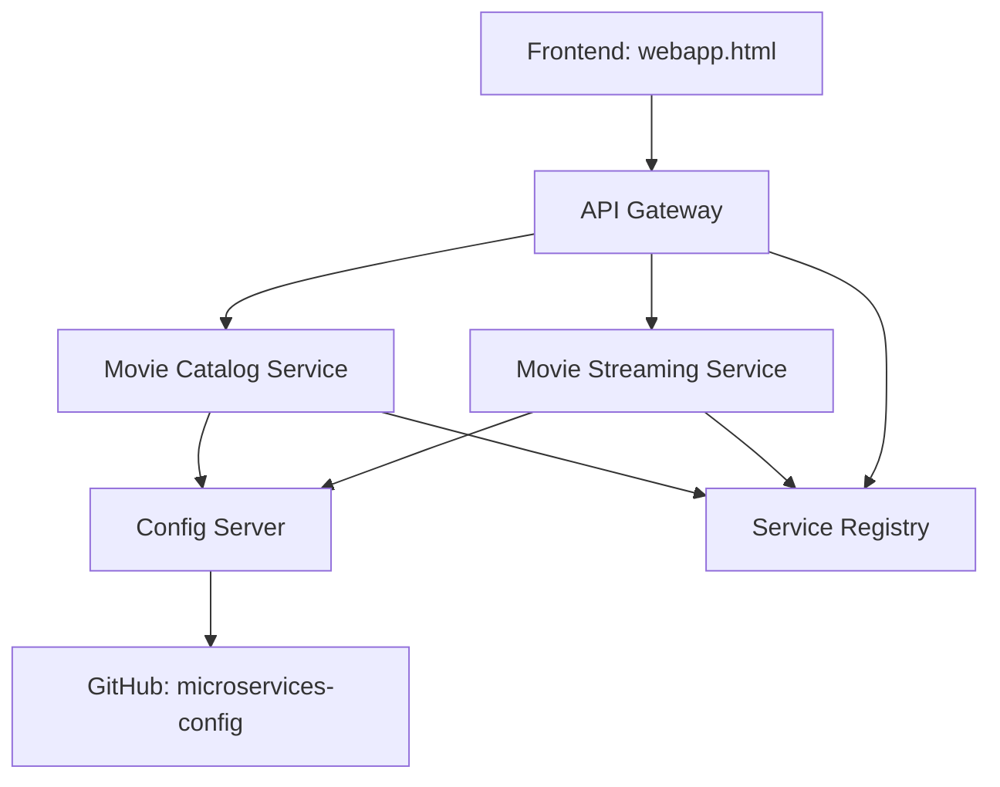

# **S**treamTree — Microservices Movie Streaming Project

[](https://openjdk.org/) [](#) [](#)





##**🚀 Project Overview**

_StreamTree is a microservices-based movie streaming platform built with Spring Boot._

This project demonstrates:

-> Config Server: Centralized configuration for all services using GitHub repo.

-> Service Registry (Eureka): Automatic registration and discovery of microservices.

-> API Gateway: Single entry point routing requests to microservices.

-> Movie Services: Catalog and streaming services.

-> Frontend HTML: Basic web interface to display movies and stream content.


## 📂 Project Structure

```
StreamTree/
├── api-gateway/                # API Gateway service
├── config-server/              # Spring Cloud Config Server
├── movie-catalog-service/      # Movie catalog microservice
├── movie-streaming-service/    # Streaming microservice
├── service-registry/           # Eureka Service Registry
├── webapp.html                 # Frontend web interface
└── README.md
```


Config Repo (separate): https://github.com/dheeshi/microservices-config

Stores *.properties for all microservices.

Loaded by Config Server at runtime.


##**🛠 Technologies Used**

Java 17, Spring Boot

Spring Cloud Config

Eureka Service Registry

API Gateway (Spring Cloud Gateway)

Maven

Zipkin (distributed tracing)

HTML / JS (frontend)


##**⚙ How to Run Locally**

Step-by-step :

1) clone the repository

git clone https://github.com/dheeshi/StreamTree.git 

cd StreamTree


2.1) Start Config Server

cd config-server  

mvn spring-boot:run


2.2) Start Service Registry (Eureka)

cd service-registry

mvn spring-boot:run


2.3) Start other microservices (catalog, streaming, gateway)


a)catalog service

cd movie-catalog-service

mvn spring-boot:run

b)streaming service

cd movie-streaming-service

mvn spring-boot:run

c)gateway service

cd api-gateway

mvn spring-boot:run


3) Open Frontend;
   
Open webapp.html in a browser.
It will connect to API Gateway endpoints.


📸 Screenshots
(Add screenshots of:)
Eureka Dashboard showing registered services
API Gateway endpoints response
Frontend webapp showing movies


**🔗 Project Links**

GitHub Repo: https://github.com/dheeshi/StreamTree

Config Repo: https://github.com/dheeshi/microservices-config

-> Config Server loads service properties from a separate GitHub repo, keeping sensitive info out of the main project.

-> Frontend is static HTML for demonstration purposes.


##**📝Key Notes**


The basics of microservice architecture
Create a video streaming app using microservices
Implementing service registry with Eureka server
Creating and testing individual microservices
Using API Gateway with Spring Cloud Routing
Service-to-service communication
Centralized configuration management with config server
Distributed tracing system with Zipkin


